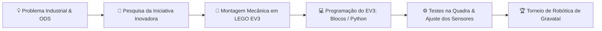

 

  

---

# 🤖 Participação na Temporada

Este repositório reúne a documentação, estratégias e códigos do robô desenvolvido pela equipe **JaguaRS** para o **Torneio de Robótica de Gravataí (TRG)**.

Nesta edição, focada no tema **Futuro da Indústria**, nosso projeto utiliza a plataforma **LEGO® MINDSTORMS® EV3** para a resolução dos desafios na arena e divide-se em duas frentes principais:

- **Quadra Cooperativa de Desafios:** Construção e programação do robô em **LEGO EV3** para atuar no transporte, automação e logística industrial (modos Autônomo e Teleoperado).
- **Iniciativa Inovadora:** Pesquisa científica voltada a soluções para o setor industrial, alinhada aos **ODS 9** (Indústria, Inovação e Infraestrutura) e **ODS 12** (Consumo e Produção Responsáveis).

---

# 📊 Dashboard da Competição

| Item | Detalhes |
|------|----------|
| **Torneio** | Torneio de Robótica de Gravataí (TRG) |
| **Plataforma de Robótica** | **LEGO® MINDSTORMS® EV3** |
| **Tema da Temporada** | *Futuro da Indústria* |
| **Modalidades** | Quadra Cooperativa de Desafios & Iniciativa Inovadora |
| **Foco nos ODS** | ODS 9 (Indústria) e ODS 12 (Consumo e Produção Responsáveis) |
| **Realização** | SMICT / Prefeitura de Gravataí & Aidtec |

---

# 🛠️ Tecnologias & Desenvolvimento com LEGO EV3

| Área | Tecnologias / Aplicação no EV3 |
|------|--------------------------------|
| **Hardware Principal** | Bloco Inteligente **LEGO® EV3**, Servomotores e Estrutura Technic |
| **Sensores** | Sensores de Cor/Luminosidade (seguimento de linha) e Sensor Ultrassônico (distância) |
| **Programação** | Programação em Blocos (EV3 Classroom) / Python para EV3 |
| **Estratégia & Lógica** | Algoritmos de navegação autônoma, alinhamento por linha e controle teleoperado |
| **Pesquisa Científica** | Metodologia científica aplicada à *Iniciativa Inovadora* |

---

# 🎯 Objetivos com o Robô EV3

🟠 Construir um robô robusto e preciso utilizando a plataforma LEGO EV3

🟠 Garantir leitura rápida e precisa de sensores para alinhamento e autonomia na quadra

🟠 Maximizar o desempenho em aliança com outras equipes na **Quadra Cooperativa**

🟠 Apresentar uma **Iniciativa Inovadora** com impacto positivo na indústria local

---

# 🔄 Pipeline da Temporada TRG

---

# 📍 Informações do Torneio

📷 **Instagram Oficial do Evento:** [@torneioroboticagravatai](https://www.google.com/search?q=https://instagram.com/torneioroboticagravatai)

📍 **Local:** Ginásio Municipal Aline Fofonka — Gravataí / RS

---

### 🐆 JaguaRS • Torneio de Robótica de Gravataí • LEGO® EV3
